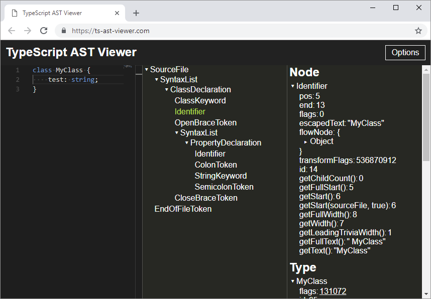

## AST Viewers

An AST viewer is a useful way to help understand the TypeScript AST for some source code.

### TypeScript AST Viewer

I've created this very basic web-based TypeScript AST viewer.

[TypeScript AST Viewer](http://ts-ast-viewer.com)

Features:

- View code on left, tree in middle, and information about selected node on right.
- View the type and symbol of the selected node.
- Toggle the tree between `node.forEachChild(...)` and `node.getChildren()`.
- Change compiler API versions.
- Use some compiler objects in the browser console.

I will improve and add more functionality to this in the future. You can help contribute to its progress [here](https://github.com/dsherret/ts-ast-viewer).

### Atom TypeScript

This AST viewer gives an excellent view of the AST.

1. Install [Atom](https://atom.io/).
2. Install [atom-typescript](https://atom.io/packages/atom-typescript).
3. Create a new typescript file.
4. Paste in your typescript code.

   

5. Important: Ensure the current typescript document has focus.
6. Open the command palette (Windows/Linux: `ctrl+shift+p`, Mac: `cmd+shift+p`).
7. Type `TypeScript: Ast Full` and hit enter (or run `TypeScript: Ast` to get the ast without tokens).

   

8. A new tab will appear with the AST.

   
